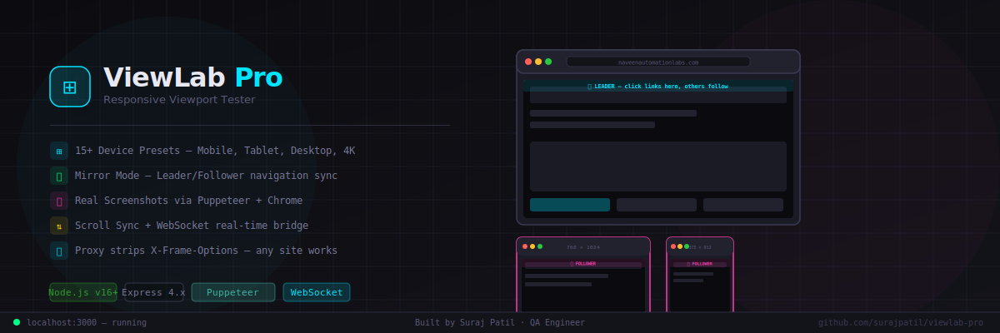

# ⊞ ViewLab Pro — Responsive Viewport Tester



> Test your websites across multiple device viewports simultaneously — with Mirror Mode, Scroll Sync, real Screenshots, and a local proxy that loads any website.


---

## ✨ Features

| Feature | Description |
|---|---|
| 📱 **15+ Device Presets** | iPhone SE, iPhone 14, Galaxy S23, Pixel 7, iPad Mini, iPad Pro, Laptop HD, Desktop FHD, 4K |
| ⊞ **Multi-Device View** | All viewports rendered side by side simultaneously |
| 🪞 **Mirror Mode** | Set a Leader viewport — all Followers navigate to the same page automatically |
| ⇅ **Scroll Sync** | Scroll all devices together in real time via WebSocket |
| 📷 **Real Screenshots** | Puppeteer + system Chrome takes actual screenshots at exact viewport sizes |
| 🌐 **Proxy Server** | Strips X-Frame-Options so ANY website loads in iframes |
| ⟳ **Per-Device Rotate** | Flip portrait to landscape per device card |
| ➕ **Custom Viewports** | Add any width x height |
| ⊞ **Grid Overlay** | Toggle background grid for alignment reference |
| 🖥 **Inspector Panel** | Live device info, zoom level, sync status |

---

## 🪞 Mirror Mode — How It Works

Mirror Mode uses a **WebSocket bridge** + **script injection** to sync navigation across all viewports:

1. Click **🪞 Mirror** button → all cards show a yellow **"SET AS LEADER"** banner
2. Click any banner → that viewport becomes the **👑 LEADER** (cyan glow)
3. All other viewports become **🪞 FOLLOWERs** (pink glow)
4. Click any link inside the Leader → all Followers navigate to the same URL instantly
5. Scroll in the Leader → all Followers scroll to the same position
6. Toggle OFF → everything goes back to independent mode

```
Leader clicks link  →  mirror.js detects it
        │
        ↓
  WebSocket → proxy.js server
        │
        ├──→  Follower 1 navigates
        ├──→  Follower 2 navigates
        └──→  Follower 3 navigates
```

---

## 🚀 Quick Start

### Prerequisites
- [Node.js](https://nodejs.org) v16 or above
- Google Chrome installed (used for screenshots)

### Step 1 — Clone the repo
```bash
git clone https://github.com/surajpatil/viewlab-pro.git
cd viewlab-pro
```

### Step 2 — Install dependencies
```bash
npm install
npm install puppeteer
```

### Step 3 — Start the server

**Windows:**
```bash
start.bat
```
or
```bash
node proxy.js
```

**Mac / Linux:**
```bash
node proxy.js
```

### Step 4 — Open in browser
```
http://localhost:3000
```

---

## 🎯 How to Use

1. Open `http://localhost:3000`
2. Click **⚡ Load Default Devices** or select devices from the toolbar
3. Enter any URL (e.g. `naveenautomationlabs.com`) in the URL bar
4. Click **▶ Load** — all viewports preview simultaneously
5. Click **🪞 Mirror** → pick a Leader → click links to sync navigation
6. Click **📷** to take screenshots saved to `/screenshots` folder

---

## 🗂️ Project Structure

```
viewlab-pro/
├── proxy.js            # Express + WebSocket server + proxy + screenshot API
├── mirror.js           # Injected script (runs inside every proxied page)
├── viewlab-pro.html    # Frontend UI
├── package.json
├── start.bat           # Windows one-click start
├── screenshots/        # Auto-created — stores PNG screenshots
└── viewlab-banner.svg  # README banner
```

---

## 🛠️ Troubleshooting

| Problem | Solution |
|---|---|
| Port already in use | Edit proxy.js and change PORT = 3000 to 3001 |
| Screenshot fails | Make sure Google Chrome is installed |
| Mirror Mode not syncing | Check CMD for Mirror navigate logs |
| Site not loading | Some sites use JS frame detection the proxy cannot bypass |
| node_modules missing | Run npm install then npm install puppeteer |
| WS not connecting | Make sure server is running and page is fully loaded |

---

## 👨‍💻 Author

**Suraj Patil** — QA Engineer
Built for responsive testing and QA workflows.

---

## 📄 License

ISC License — free to use and modify.
